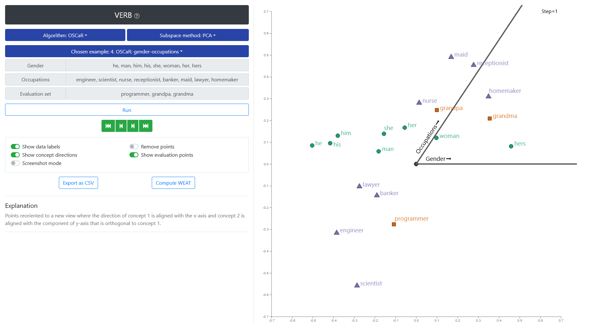

<!-- # VERB: Interactive Bias Mitigation Techniques for Word Representations -->

## Abstract

Word vector embeddings have been shown to contain and amplify biases in data they are extracted from. Consequently, many techniques have been proposed to identify, mitigate, and attenuate these biases in word representations. In this tutorial, we will review a collection of state-of-the-art debiasing techniques. To aid this, we provide an open source web-based visualization tool and offer hands-on experience in exploring the effects of these debiasing techniques on the geometry of high-dimensional word vectors. To help understand how various debiasing techniques change the underlying geometry, we decompose each technique into interpretable sequences of primitive operations, and study their effect on the word vectors using dimensionality reduction and interactive visual exploration.

----
## Using VERB

    

You can explore VERB and it's capabilities using this [link](http://archit.sci.utah.edu:5001).

VERB can also be installed locally by following the [installation instructions](https://github.com/tdavislab/verb/#requirements).